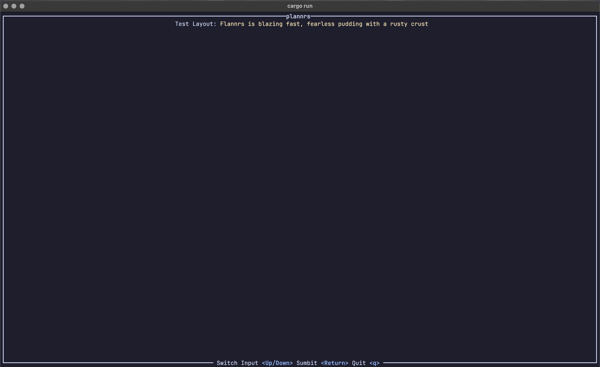

# plannrs
 

## So far we have...

A TUI-Based day planner with desktop notifications, to keep your programming and work goals on track without having to leave the terminal :3
## First Release Goals
- [x] Task struct with name, description, completion, and due date.
- [ ] Adding a simple task to a `.toml` file with easy interface
- [ ] List displaying all tasks with simple marking for completion
- [ ] Highlight if a task is overdue
## Future plans (unordered)
- [ ] Calendar View
- [ ] Adding events in the calendar to go alongside visualising task due dates
- [ ] Unified location for tasks and config
- [ ] Implementation of study sessions with optional porsmo (pomodoro) integration.
- [ ] Support for Vim- and Emacs-like keybinds
- [ ] Integrations with common calendar APIs
- [ ] Custom themes
- [ ] Optional daemon with desktop notifications for major platforms 
## License
plannrs, a terminal user interface for creating and managing scheduling and tasks.
Copyright (C) 2026  Alexis Williams

This program is free software: you can redistribute it and/or modify
it under the terms of the GNU Affero General Public License as published
by the Free Software Foundation, either version 3 of the License, or
(at your option) any later version.

This program is distributed in the hope that it will be useful,
but WITHOUT ANY WARRANTY; without even the implied warranty of
MERCHANTABILITY or FITNESS FOR A PARTICULAR PURPOSE.  See the
GNU Affero General Public License for more details.

You should have received a copy of the GNU Affero General Public License
along with this program.  If not, see <https://www.gnu.org/licenses/>.
